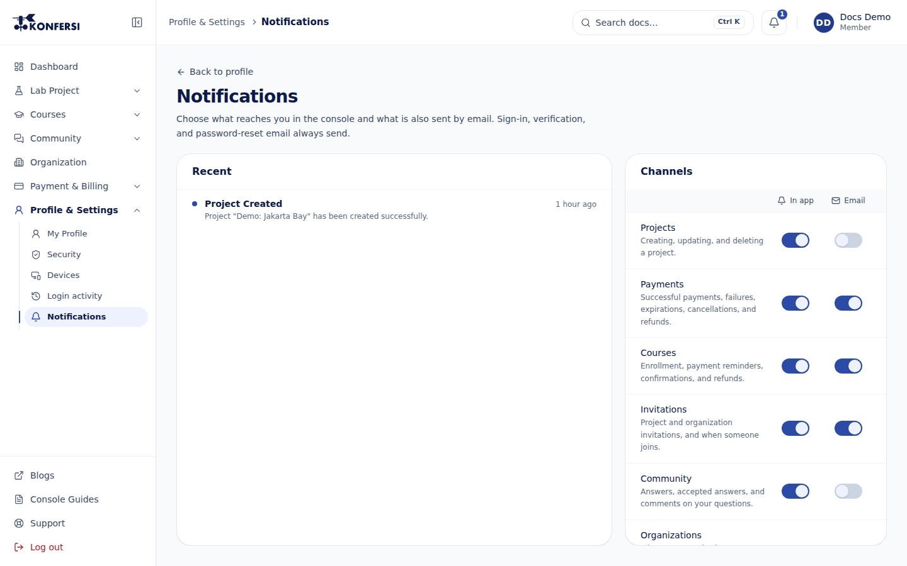

Konfersi tells you about things that need you: payments, course enrolments, invitations, replies to your questions and support tickets, finished Lab jobs and changes to your account. You see them in the Console, and for most categories you also get an email.

## The bell

The bell at the top of the Console shows how many notifications you haven't read. Select it to see the latest ones:

- Select a notification to open the page it's about. It's then marked as read.
- **Mark all read** marks every notification as read.
- **Notification settings** opens the settings page.

The list updates on its own while the Console is open.

## Notification settings

Open **Profile & Settings → Notifications**, or select **Notification settings** under the bell.

- **Recent** lists your notifications, newest first. Unread ones have a dot.
- **Channels** has a row per category, each with an **In app** switch and an **Email** switch.

Each switch is saved the moment you flip it; there's no Save button. Your choices apply to your account on every device.

## Categories

| Category | What it covers | Email when you start |
|---|---|---|
| **Projects** | Creating, updating, and deleting a project | Off |
| **Payments** | Successful payments, failures, expirations, cancellations, and refunds | On |
| **Courses** | Enrollment, payment reminders, confirmations, and refunds. Includes **Your certificate is ready** | On |
| **Invitations** | Project and organization invitations, and when someone joins | On |
| **Community** | Answers, accepted answers, and comments on your questions | Off |
| **Organizations** | Join requests, role changes, new members, and domain verification | On |
| **Support** | When a ticket is received, replied to, or changes status | On |
| **Lab** | When a planning, analysis, risk, or report job finishes or fails. Data downloads stay quiet | Off |
| **Security** | Password and profile changes in the Console | On, can't be turned off |

**In app** is on for every category to start with.

## Email that always sends

Some email is needed to keep your account safe and usable, so you can't turn it off: sign-in codes and links, email verification, password resets and account recovery. The **Security** row shows a lock instead of an **Email** switch (**Account security email always sends**).

If someone invites you to a project or an organization before you have a Konfersi account, you still get the invitation email.

## Related

- [Share a project](../using-konfersi/project-sharing.md): the invitation, joined and left notifications.
- [Certificates](../using-konfersi/certificates.md): the certificate-ready notification.
- [Your profile](profile.md) and [Security](security/index.md).
