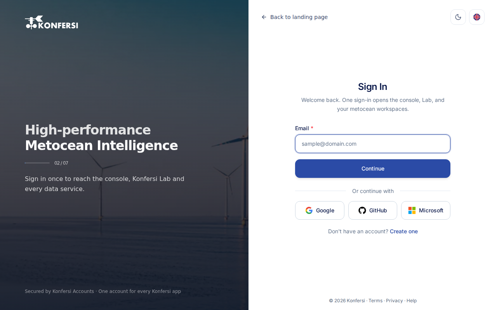

Konfersi uses one sign-in for all of its apps. When you sign in at Accounts, the same session works in the Console, in Lab and in your metocean workspaces.

## Sign in with email and password

1. Go to [accounts.konfersi.com](https://accounts.konfersi.com). If you open [app.konfersi.com](https://app.konfersi.com) or [lab.konfersi.com](https://lab.konfersi.com) without a session, you're sent there automatically.
2. Enter your **Email** and select **Continue**.
3. Enter your **Password** and select **Sign In**. Select **Change** if you typed the wrong email.

Once you're signed in, Konfersi takes you back to the page you started from. If you came straight to Accounts, you land in the Console.

<scalar-callout type="info">If your profile isn't complete yet, you'll see the **Complete Profile** form first. See [Create an account](create-account.md#step-3-complete-your-profile).</scalar-callout>

## Sign in with a provider

If sign-in providers are available, their buttons appear under **Or continue with**.

1. Select the provider you used when you signed up.
2. Approve the request on the provider's page.
3. You're returned to Konfersi and signed in.

### Connect a provider to an existing account

You can add a provider to an account you already have, so that either method signs you in.

1. In the Console, open **My Profile**.
2. Under **Connect Social Links**, select **Connect** next to the provider.
3. Check the email address on the **Connect** page, then select **Continue to** the provider.
4. Approve the request on the provider's page.

## Forgot your password

1. On the **Sign In** page, select **Forgot Password?**.
2. Enter your **Email** and select **Send reset link**.
3. Open the email and select the reset link. The link expires after a short time.
4. On **Choose a new password**, enter a **New Password** of at least 8 characters, and enter it again under **Confirm Password**.
5. Select **Update password**, then sign in with your new password.

The confirmation screen always looks the same, whether or not an account exists for the address you entered. This protects your privacy.

<scalar-callout type="neutral">Accounts created with a sign-in provider don't have a Konfersi password to reset or change. Sign in with that provider instead.</scalar-callout>

## Approve a Konfersi Lab sign-in

When you sign in from the Konfersi Lab extension in desktop VS Code, a browser tab opens at Accounts.

1. Sign in if you're asked to.
2. On **Sign in to Konfersi Lab**, check that the email address is yours.
3. Select **Approve device** only if you started this sign-in yourself.
4. When you see **Device signed in**, close the tab and return to VS Code.

See [Lab workspace](../using-konfersi/lab-workspace.md) for more on the extension.

## Sign out

Use **Log out** in the Console's profile menu. This ends your session on this device.

## Troubleshooting

**"Invalid email or password."**
Check the email address for typos, or reset your password.

**"Verify your email address before signing in."**
Your email isn't verified yet. Select **Resend the verification email**, then open the newest link. See [Create an account](create-account.md#step-2-verify-your-email).

**Provider sign-in fails or is cancelled**

- If the provider didn't share an email address, make sure your provider account has a verified email, or sign in with email instead.
- If the attempt expired or was opened in another tab, start again from the Konfersi sign-in page.
- If the provider account is already connected to a different Konfersi account, sign in to that account instead.
- If the provider confirmed who you are but the session didn't start, check that your browser allows cookies for konfersi.com and try again.

**The reset link says it is invalid or has expired.**
Select **Request a new link** and use the newest email.

Still stuck? [Contact support](../support/contact-support.md). Don't include your password in a support message.
