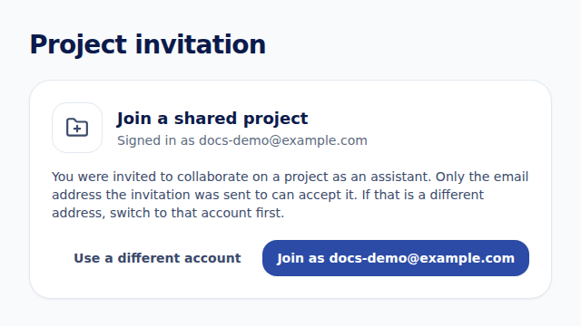

Projects are private: only the owner and the people they invite can open them. People you invite join as **assistants**. They can open the project in the Console and in Lab and work on its points, analyses and documents. Only the owner can edit or delete the project and decide who has access.

## Who can share

Only the project's owner can share it. Open the project and select the **⋯** menu (**Project actions**), then **Manage Project Access**. The option is there when the project's plan or add-ons include assistant seats.

To give a whole team access at once, share the project with an organization instead. See [Shared projects & courses](organizations/shared-projects-and-courses.md).

## Invite an assistant

1. In **Manage Project Access**, enter your collaborator's email address in **Add your assistant via email..** and select **Share**.
2. Konfersi emails them an invitation with your name and the project name.
3. The invitation appears under **Invitation List** as **Pending** until they accept it.

Good to know:

- An invitation is valid for **7 days**.
- You can't invite yourself, someone who is already a collaborator, or an address that already has a pending invitation.
- If the email couldn't be sent, the Console shows **The invitation was saved, but the email could not be sent. They will still see it after signing in with that address.**

## Assistant seats

Each assistant uses one seat, and **a pending invitation holds a seat too**. Under the email field, the Console shows how many are in use, for example **2 of 3 assistant seats used (pending invitations included).**

When every seat is taken, the field is disabled and the Console explains: **All 3 assistant seats are taken (3 incl. pending invitations). Cancel an invitation or add a Project Assistant Seat add-on.** To free a seat, cancel a pending invitation or remove an assistant. To get more, buy the **Project Assistant Seat** add-on with **Buy Add-Ons** on the project page. See [Plans & pricing](../billing/plans-and-pricing.md).

## Cancel an invitation

Under **Invitation List**, select **Cancel** next to the invitation, then **Cancel invitation**. The link in their email stops working and the seat is free again.

## Remove an assistant

Under **Who can access**, open the **Assistant** menu next to the person and choose **Remove Collaborator**, then **Remove**. They lose access to the project straight away, and their seat is free again.

## Accept an invitation

Select the link in the invitation email:

- **No Konfersi account yet?** You're taken to sign up with the invited address. After you [complete your profile](../getting-started/create-account.md), the Console joins you to the project.
- **Already have an account?** Sign in with the invited address. The Console joins you to the project and opens it.

The project then appears under **Lab Project → My Projects**, and the owner gets a notification that you joined.

### Signed in with a different email

An invitation belongs to the email address it was sent to. If you open the link while signed in with another account, the **Project invitation** page shows **Signed in as** with your current address:

- Select **Join as** your address to try to join with this account. If the invitation was sent to another address, the page says so: *You are signed in as (your address), but this invitation was sent to a different email address. Only that address can accept it.*
- To switch, select **Copy invitation link**, then **Switch account** (or **Use a different account**). Sign in with the invited address and open the link again.
- If you'd rather use your current account, ask the project owner to invite that address instead.

<scalar-callout type="info">Only the invited address can accept, even if someone forwards you the link. This keeps each seat tied to the person the owner chose.</scalar-callout>

### If the link doesn't work

| The page shows | What to do |
|---|---|
| **Invitation expired** | Invitations are valid for 7 days. Ask the project owner to send a new one |
| **Invitation no longer open** | The invitation was already accepted, cancelled by the owner, or the link is incomplete. If you already joined, the project is in **My Projects** |

## Leave a project

If you're an assistant and no longer need a project:

1. Open the project from **Lab Project → My Projects**.
2. Select **Leave project**, then confirm with **Leave project**.

You lose access to its points, analyses and documents, and the owner is notified. The owner can invite you again later. The owner can't leave their own project.

## Notifications

Invitations, people joining and people leaving show up in the Console's notifications. To choose which of them are also emailed to you, see [Notifications](../account/notifications.md).
