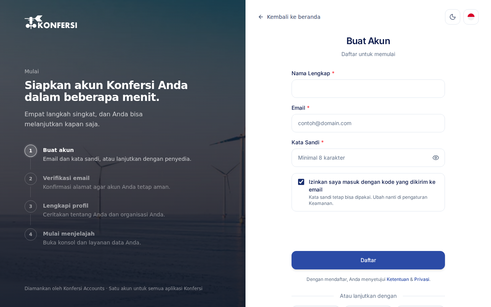
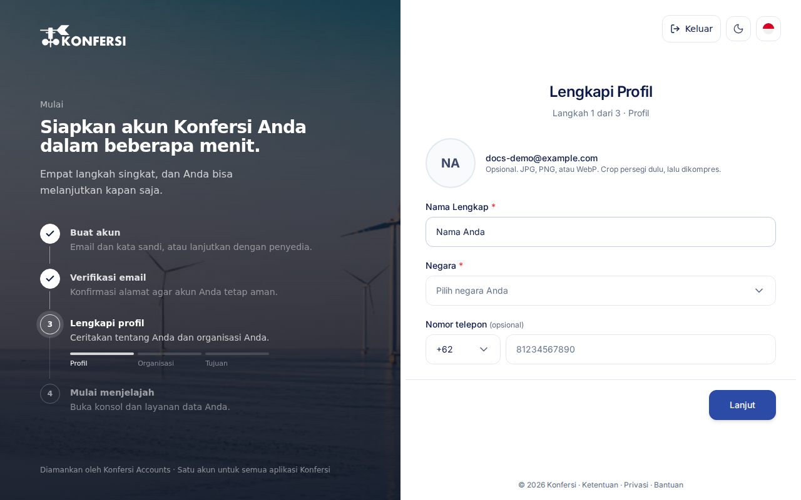

Satu akun Konfersi membuka Console, Lab, dan semua layanan data Konfersi. Penyiapannya hanya empat langkah singkat: buat akun, verifikasi email, lengkapi profil, lalu mulai menjelajah.

## Sebelum memulai

Siapkan:

- Alamat email yang bisa langsung Anda buka, atau akun di salah satu penyedia masuk yang tampil di halaman pendaftaran.
- Opsional: beberapa informasi tentang organisasi Anda, seperti nama, sektor, dan peran Anda. Jika Anda anggota organisasi di Konfersi, atau diundang ke salah satunya, Anda bisa memakai detail organisasi tersebut tanpa mengetik ulang.

Dengan mendaftar, Anda menyetujui [Ketentuan Layanan](../legal/terms.md) dan [Kebijakan Privasi](../legal/privacy.md). Mohon baca keduanya terlebih dahulu.

## Langkah 1: Buat akun

1. Buka [accounts.konfersi.com](https://accounts.konfersi.com). Di halaman **Masuk**, pilih **Buat akun**.
2. Di halaman **Buat Akun**, isi:
   - **Nama Lengkap**
   - **Email**
   - **Kata Sandi**: minimal 8 karakter.
3. Pilih **Daftar**.

Setelah itu, layar **Periksa kotak masuk Anda** muncul dan menampilkan alamat tujuan tautan verifikasi.

<scalar-callout type="neutral">Mulai dari situs web Konfersi? Pilih **Daftar** di bilah atas, **Buat akun gratis** di beranda, atau **Mulai** pada salah satu paket di halaman [Harga](../billing/plans-and-pricing.md#melihat-paket-di-situs-web-konfersi). Masing-masing langsung membuka halaman **Buat Akun**. Jika Anda memverifikasi email di browser yang sama, lalu masuk dan melengkapi profil, Anda kembali ke halaman asal, bukan ke beranda Console.</scalar-callout>

### Mendaftar dengan penyedia

Jika penyedia masuk tersedia, tombolnya muncul di bawah **Atau lanjutkan dengan**. Pilih salah satu, lalu setujui permintaan di halaman penyedia tersebut. Konfersi menerima nama dan alamat email Anda dari penyedia, jadi Anda tidak perlu membuat kata sandi. Anda kemudian langsung diarahkan untuk [melengkapi profil](#langkah-3-lengkapi-profil).

## Langkah 2: Verifikasi email

1. Buka email dari Konfersi, lalu pilih tautan verifikasi di dalamnya.
2. Saat muncul **Email terverifikasi**, pilih **Ke halaman masuk**.
3. Masuk dengan email dan kata sandi Anda.

<scalar-callout type="info">Email bisa butuh beberapa menit untuk sampai. Periksa juga folder spam. Agar email berikutnya tidak tersaring, tambahkan alamat pengirim yang tertera di layar ke daftar kontak Anda.</scalar-callout>

Jika email tidak kunjung datang, pilih **Kirim ulang email verifikasi** di bawah tulisan **Belum menerima email setelah beberapa menit?**. Masukkan alamat yang Anda daftarkan, lalu kirim ulang permintaannya. Mengirim ulang tidak akan membuat akun kedua.

## Langkah 3: Lengkapi profil

Saat pertama kali masuk, Anda akan diminta melengkapi profil. Formulir **Lengkapi Profil** terdiri dari tiga langkah. Gunakan **Lanjut** dan **Kembali** untuk berpindah langkah.

**Profil**

1. Opsional: pilih **Unggah foto** untuk menambahkan foto profil berformat JPG, PNG, atau WebP.
2. Periksa **Nama Lengkap** Anda.
3. Pilih **Negara**.
4. Opsional: isi **Nomor telepon**.

**Organisasi**

Langkah ini opsional. Pilih **Lanjut** untuk melewatinya.

- Jika Anda anggota organisasi di Konfersi, atau diundang ke salah satunya, organisasi itu tampil paling atas dan sudah terpilih. Detailnya ditampilkan untuk Anda periksa, dan Anda hanya perlu memilih **Peran**. Pemilik organisasi menjaga detail ini tetap terbaru. Untuk undangan, profil Anda mengikuti organisasi setelah undangan diterima.
- Untuk mengisi sendiri, pilih **Isi detail sendiri** (atau langsung isi kolomnya jika tidak ada organisasi yang tampil). Isi **Nama Organisasi**, misalnya nama perusahaan atau sekolah, lalu opsional jenis, sektor, ukuran, situs web, lokasi, dan **Peran** Anda. Jika tidak ada pilihan yang cocok, ketik sendiri lalu tambahkan. Jika Anda mengisi salah satu kolom ini, nama organisasi juga perlu diisi.

**Tujuan**

1. Jawab pertanyaan **Dari mana anda mengetahui kami?**.
2. Pada **Tujuan pembuatan akun**, pilih opsi hingga batas jumlah yang tertera.
3. Centang **Saya menyetujui Ketentuan Layanan**.
4. Pilih **Selesaikan Pendaftaran**.

Saat muncul **Semua siap**, Anda akan diarahkan ke Console dalam beberapa detik. Anda juga dapat memilih **Buka Konsol sekarang**.

<scalar-callout type="neutral">Jawaban Anda tetap tersimpan selama Anda berpindah langkah di tab browser yang sama. Jika tab ditutup sebelum selesai, Anda akan diminta melengkapi profil lagi saat masuk berikutnya.</scalar-callout>

## Langkah 4: Mulai menjelajah

Console terbuka dengan panduan sambutan singkat. Anda dapat mengikuti tur, mengatur profil, atau membuat proyek pertama. Lanjutkan ke [Console & proyek](../using-konfersi/console-projects.md).

## Pemecahan masalah

**"Email ini sudah terdaftar."**
Anda sudah memiliki akun dengan alamat ini. Pilih **Masuk**, atau pilih **Lupa Kata Sandi?** untuk membuat kata sandi baru. Lihat [Masuk](sign-in.md).

**"Kata sandi minimal 8 karakter."**
Gunakan kata sandi yang lebih panjang.

**"Kami tidak dapat memuat daftar pilihan."**
Daftar pilihan di formulir profil gagal dimuat. Pilih **Coba lagi**.

**Tautan verifikasi dinyatakan tidak valid atau sudah kedaluwarsa.**
Minta tautan baru dari halaman verifikasi, lalu gunakan email yang paling baru.

Masih mengalami kendala? [Hubungi tim bantuan](../support/contact-support.md).

## Terkait

- [Masuk](sign-in.md)
- [Paket & harga](../billing/plans-and-pricing.md)
- [Kebijakan Privasi](../legal/privacy.md)
