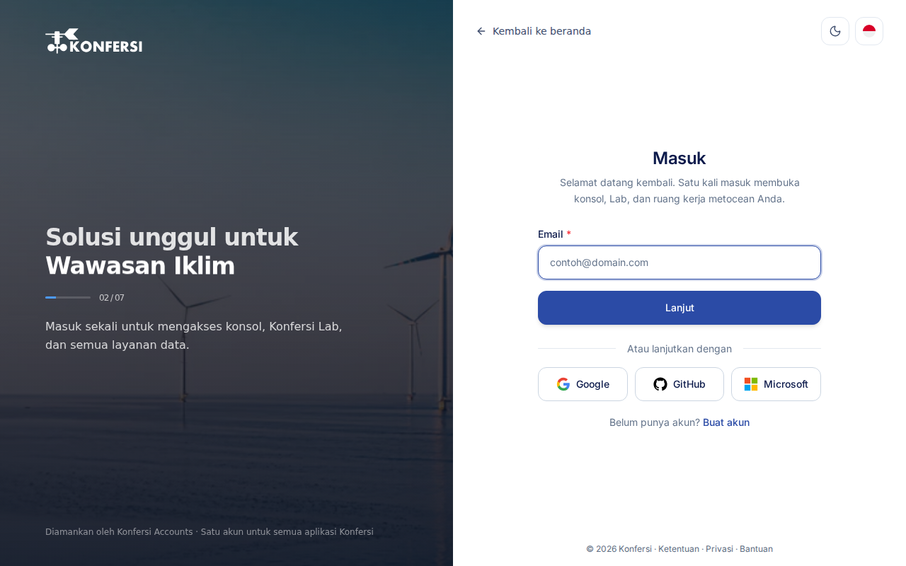

Konfersi memakai satu proses masuk untuk semua aplikasinya. Setelah Anda masuk di Accounts, sesi yang sama berlaku di Console, Lab, dan ruang kerja metocean Anda.

## Masuk dengan email dan kata sandi

1. Buka [accounts.konfersi.com](https://accounts.konfersi.com). Jika Anda membuka [app.konfersi.com](https://app.konfersi.com) atau [lab.konfersi.com](https://lab.konfersi.com) tanpa sesi aktif, Anda akan diarahkan ke sana secara otomatis.
2. Isi **Email** lalu pilih **Lanjut**. Pilih **Ubah** jika email yang Anda ketik salah.
3. Jika tautan masuk lewat email aktif untuk akun Anda (bawaan untuk akun baru), Konfersi mengirim tautan masuk ke email Anda. Buka tautan itu dalam 10 menit untuk masuk. Anda juga bisa:
   - memilih **Masukkan kode secara manual** untuk mengetik kode dari email
   - menunggu lalu memilih **Kirim tautan baru**
   - memilih **Pakai kata sandi**
4. Jika tidak, atau setelah memilih **Pakai kata sandi**, isi **Kata Sandi** lalu pilih **Masuk**.

Anda bisa menyalakan atau mematikan tautan masuk lewat email di pengaturan keamanan akun.

Setelah berhasil masuk, Anda dikembalikan ke halaman asal. Jika Anda langsung membuka Accounts, Anda akan masuk ke Console.

<scalar-callout type="info">Jika profil Anda belum lengkap, formulir **Lengkapi Profil** akan muncul terlebih dahulu. Lihat [Membuat akun](create-account.md#langkah-3-lengkapi-profil).</scalar-callout>

## Masuk dengan penyedia

Jika penyedia masuk tersedia, tombolnya muncul di bawah **Atau lanjutkan dengan**.

1. Pilih penyedia yang Anda gunakan saat mendaftar.
2. Setujui permintaan di halaman penyedia.
3. Anda dikembalikan ke Konfersi dalam keadaan sudah masuk.

### Menghubungkan penyedia ke akun yang sudah ada

Anda dapat menambahkan penyedia ke akun yang sudah ada, sehingga Anda bisa masuk dengan kedua cara.

1. Di Console, buka **Profil Saya**.
2. Di bagian **Hubungkan Akun Sosial**, pilih **Hubungkan** di samping penyedia yang diinginkan.
3. Periksa alamat email di halaman **Hubungkan**, lalu pilih **Lanjut ke** penyedia tersebut.
4. Setujui permintaan di halaman penyedia.

## Lupa kata sandi

1. Di halaman **Masuk**, pilih **Lupa Kata Sandi?**.
2. Isi **Email**, lalu pilih **Kirim tautan reset**.
3. Buka email tersebut dan pilih tautan reset. Tautan ini hanya berlaku dalam waktu singkat.
4. Di halaman **Pilih kata sandi baru**, isi **Kata Sandi Baru** minimal 8 karakter, lalu ulangi di **Konfirmasi Kata Sandi**.
5. Pilih **Perbarui kata sandi**, lalu masuk dengan kata sandi baru.

Layar konfirmasi selalu tampil sama, baik ada maupun tidak ada akun untuk alamat yang Anda masukkan. Ini untuk melindungi privasi Anda.

<scalar-callout type="neutral">Akun yang dibuat melalui penyedia masuk tidak memiliki kata sandi Konfersi yang bisa diatur ulang atau diubah. Masuklah melalui penyedia tersebut.</scalar-callout>

## Menyetujui proses masuk Konfersi Lab

Saat Anda masuk dari ekstensi Konfersi Lab di VS Code desktop, tab browser akan terbuka di Accounts.

1. Masuk jika diminta.
2. Di halaman **Masuk ke Konfersi Lab**, pastikan alamat email yang tertera adalah milik Anda.
3. Pilih **Setujui perangkat** hanya jika Anda sendiri yang memulai proses masuk ini.
4. Saat muncul **Perangkat sudah masuk**, tutup tab dan kembali ke VS Code.

Informasi lebih lanjut tentang ekstensi ini ada di [Ruang kerja Lab](../using-konfersi/lab-workspace.md).

## Keluar

Gunakan **Keluar** di menu profil Console. Ini akan mengakhiri sesi Anda di perangkat tersebut.

## Pemecahan masalah

**"Email atau kata sandi salah."**
Periksa kembali penulisan email, atau atur ulang kata sandi Anda.

**"Verifikasi alamat email Anda sebelum masuk."**
Email Anda belum terverifikasi. Pilih **Kirim ulang email verifikasi**, lalu buka tautan terbaru. Lihat [Membuat akun](create-account.md#langkah-2-verifikasi-email).

**Masuk dengan penyedia gagal atau dibatalkan**

- Jika penyedia tidak membagikan alamat email, pastikan akun penyedia Anda memiliki email terverifikasi, atau masuk dengan email.
- Jika percobaan masuk kedaluwarsa atau dibuka di tab lain, mulai lagi dari halaman masuk Konfersi.
- Jika akun penyedia sudah terhubung ke akun Konfersi lain, masuklah ke akun tersebut.
- Jika penyedia sudah mengonfirmasi identitas Anda tetapi sesi tidak dimulai, pastikan browser mengizinkan cookie untuk konfersi.com, lalu coba lagi.

**Tautan reset dinyatakan tidak valid atau sudah kedaluwarsa.**
Pilih **Minta tautan baru**, lalu gunakan email yang paling baru.

Masih mengalami kendala? [Hubungi tim bantuan](../support/contact-support.md). Jangan sertakan kata sandi Anda dalam pesan ke tim bantuan.
