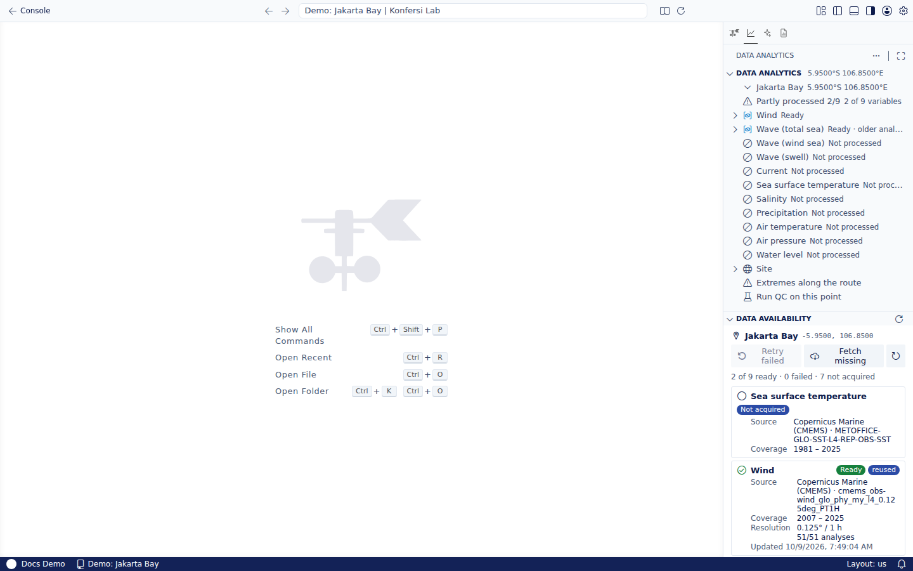

Saat Anda [memproses titik](../points/process-points.md), server Konfersi yang mengerjakannya. Editor atau browser Anda hanya memulai proses dan menampilkan kemajuannya.

## Langkah-langkahnya

1. **Permintaan.** Lab mengirim lokasi titik dan variabel yang akan diproses ke backend Konfersi, yang memeriksa akses dan kuota Anda lalu memasukkannya ke antrean.
2. **Pemeriksaan pemakaian ulang.** Jika data untuk lokasi itu sudah pernah diproses, oleh Anda atau orang lain, hasil yang tersimpan dipakai dan tidak ada yang diunduh (**Sudah diproses · dipakai ulang**). Jika proses lain sedang mengambil data yang sama, proses Anda ikut memakai hasilnya.
3. **Unduh.** Untuk setiap variabel, worker unduhan meminta datanya ke penyedia:
   - **Copernicus Marine (CMEMS)** untuk angin, gelombang, arus, suhu permukaan laut, dan salinitas. Penyedia memotong area kecil sekitar ±0,5° di sekitar titik.
   - **Copernicus Climate Data Store (ERA5)** untuk presipitasi, suhu udara, dan tekanan udara, berupa deret waktu per jam di titik tersebut. Permintaan ERA5 menunggu di antrean Copernicus, kadang cukup lama.

   Setiap variabel diterima sebagai berkas NetCDF dan disimpan dengan aman di penyimpanan Konfersi.
4. **Analisis.** Worker pemrosesan membaca berkas, mengambil **sel grid terdekat yang memiliki data** (sehingga titik dekat pantai tidak membaca sel daratan) di permukaan, lalu menjalankan semua analisis untuk variabel itu: deret waktu, statistik, mawar, distribusi gabungan, dan nilai ekstrem, untuk semua kondisi dan, bila relevan, kondisi siklonik dan non-siklonik secara terpisah.
5. **Simpan hasil.** Hasil disimpan sebagai artefak siap buka. Membuka analisis setelahnya terasa instan karena tidak ada yang dihitung ulang.

Setiap variabel ditangani terpisah, jadi variabel yang lambat atau gagal tidak menahan variabel lain. Itulah sebabnya titik bisa berstatus **Sebagian diproses**.

## Analisis lokasi

Beberapa analisis memakai sumber tambahan dan dijalankan saat Anda membukanya, bukan saat pemrosesan:

| Analisis | Sumber |
|---|---|
| **Pasang surut** | Model pasang surut global FES2022, divalidasi dengan stasiun pasang surut UHSLC terdekat jika ada |
| **Siklon tropis per bulan**, **Audit badai (500 km)** | IBTrACS, catatan internasional lintasan siklon tropis |
| **Kedalaman air** | GMRT (menggabungkan GEBCO dan survei multibeam), atau GEBCO |

## Melihat data yang dimiliki titik

Tampilan **Ketersediaan Data** di panel **Analitik Data** menampilkan setiap variabel untuk titik yang dipilih, beserta statusnya:

| Status | Artinya |
|---|---|
| **Siap** | Sudah diunduh dan dianalisis. Menampilkan berapa analisis yang siap, dan bisa bertanda analisis lama atau dipakai ulang |
| **Berjalan** | Sedang diambil atau dianalisis |
| **Gagal** | Upaya terakhir gagal |
| **Sesuai permintaan** | Dianalisis saat Anda membukanya; tidak ada yang diunduh |
| **Belum diambil** | Belum diambil untuk titik ini |

Jika diketahui, setiap variabel juga menampilkan sumber, cakupan, resolusi, dan waktu pembaruannya.

- **Coba lagi yang gagal** mengambil ulang variabel yang gagal.
- **Ambil yang belum ada** mengambil variabel yang belum diambil.
- **Tampilkan proses** menampilkan pekerjaan yang sedang berjalan, dan **Segarkan** memuat ulang daftar.

Tindakan yang sama ada di Command Palette sebagai **Tampilkan Ketersediaan Data**, **Segarkan Ketersediaan Data**, dan **Coba Lagi Variabel Gagal**. Mencoba ulang atau mengambil data memulai proses baru untuk titik tersebut.

## Tempat data Anda disimpan

- Berkas unduhan dan hasilnya disimpan Konfersi per lokasi, dan dipakai ulang antarproyek agar data yang sama tidak diunduh dua kali.
- Titik, batas, dokumen proyek, dan laporan Anda milik proyek dan hanya terlihat oleh orang yang memiliki akses ke proyek.
- [Unduh berkas NetCDF](variables-and-sources.md#mengunduh-data) kapan saja untuk mengolah data dengan alat Anda sendiri.

Untuk deskripsi dataset, lisensi, dan cara mencantumkan sumbernya, lihat [Sumber data metocean](../../using-konfersi/metocean-data-sources.md).
