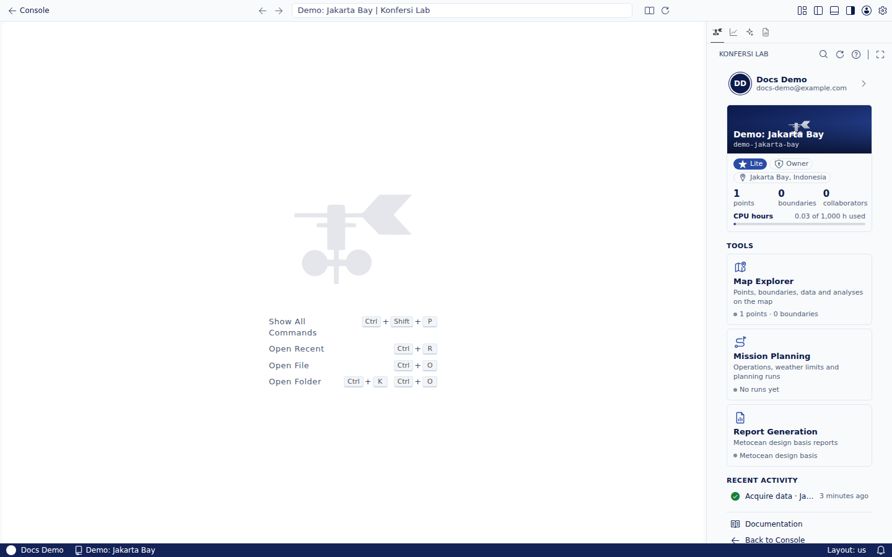

Konfersi Lab adalah ruang kerja metocean untuk satu proyek dalam satu waktu. Di Lab Anda menempatkan titik observasi di peta, memprosesnya untuk mengunduh dan menganalisis data metocean, membaca hasilnya dalam grafik, memeriksa kualitas data, merencanakan operasi, dan membuat laporan.

Lab berjalan di dua tempat dengan fitur yang sama:

- **Di browser** di [lab.konfersi.com](https://lab.konfersi.com). Tidak perlu memasang apa pun.
- **Di editor desktop**, VS Code atau Antigravity, lewat ekstensi Konfersi Lab. Lihat [Editor desktop](desktop/index.md).

Label dan nama perintah di Lab mengikuti bahasa tampilan editor Anda. Panduan ini memakai label berbahasa Indonesia.

## Yang Anda perlukan

- Akun Konfersi. Lihat [Membuat akun](../getting-started/create-account.md).
- Proyek dengan paket berbayar. Proyek dengan paket Gratis menampilkan **Tingkatkan paket untuk membuka Lab** di Console. Lihat [Paket & harga](../billing/plans-and-pricing.md).
- Menjadi pemilik proyek, asisten yang diundang, atau anggota organisasi tempat proyek dibagikan. Lihat [Proyek bersama](../using-konfersi/organizations/shared-projects-and-courses.md).

## Membuka proyek

1. Di [Console](../using-konfersi/console-projects.md), buka **Proyek Lab → Proyek Saya**.
2. Buka proyeknya, lalu di **Buka proyek ini** pilih:
   - **Konfersi Lab** untuk membukanya di browser, di tab ini atau tab baru, atau
   - **VSCode** atau **Antigravity** untuk membukanya di editor desktop (ekstensi harus sudah terpasang).

Anda juga bisa mengklik dua kali proyek di daftar untuk membukanya di Lab. Lab memakai login yang sama dengan Console.

## Mengenal ruang kerja

Lab tampil seperti editor kode. Bagian-bagiannya:

| Letak | Isinya |
|---|---|
| Bilah aktivitas → **Konfersi Lab** | **Proyek** (siapa Anda, paket, dan pemakaian kuota), **Titik**, **Data**, **Analisis**, **Validasi**, **Perencanaan & Risiko**, **Laporan**, dan **Dokumentasi** |
| Bilah aktivitas → **Penjelajah Peta** | **Titik Observasi**, **Batas Proyek**, serta **Analisis & Validasi** untuk titik yang dipilih. Membuka peta proyek |
| Bilah aktivitas → **Perencanaan Misi** | Operasi, simulasi jendela cuaca, dan hasilnya. Lihat [Mission Planning](../using-konfersi/mission-planning.md) |
| Panel → **Analitik Data** | **Grafik** analisis yang Anda buka |
| Panel → **Proses** | Setiap proses beserta kemajuannya secara langsung |
| Panel → **Log** | Baris log terperinci dari pemrosesan, yang bisa disaring |
| Bilah samping sekunder → **Kontrol** | Kontrol peta: peta dasar, overlay, dan urutannya, selama peta terbuka |
| Bilah status | Proyek aktif (pilih untuk membuka menu) dan koordinat penunjuk di peta |

Setiap aksi juga tersedia sebagai perintah. Buka Command Palette (**Ctrl+Shift+P**, atau **Cmd+Shift+P** di Mac) lalu ketik **Konfersi** untuk melihat semuanya.

Setiap bagian memiliki tombol **?** (**Bantuan**) yang membuka halaman dokumentasi terkait di dalam Lab.

## Analisis pertama Anda, langkah demi langkah

1. [Tambahkan titik observasi](points/index.md): klik peta, ketik koordinat, atau impor berkas.
2. [Proses titik](points/process-points.md) untuk mengunduh dan menganalisis data metoceannya.
3. Setelah selesai, buka analisis dari **Analisis & Validasi** atau **Analisis**. Grafiknya tampil di **Analitik Data**. Lihat [Analisis & grafik](analysis/index.md).
4. [Jalankan validasi data](analysis/data-validation.md) untuk memeriksa kualitasnya.
5. Gunakan hasilnya di [Mission Planning](../using-konfersi/mission-planning.md) dan [laporan](reports-and-documents.md).

## Kuota

Paket dan add-on proyek menentukan kuotanya. Lab menampilkan pemakaiannya di **Konfersi Lab → Proyek**:

| Kuota | Yang memakainya |
|---|---|
| Titik | Setiap titik observasi di proyek. Menambah titik melebihi batas akan gagal |
| Komputasi | Waktu untuk memproses titik dan menjalankan perencanaan |
| Penyimpanan | Data yang diunduh untuk titik-titik proyek |
| AI | Fitur AI: **Jelaskan** pada grafik, sintesis bagian laporan, dan teks laporan yang ditulis AI |

Jika kuota habis, aksi yang membutuhkannya berhenti dengan pesan. Beli add-on atau tingkatkan paket di Console. Lihat [Paket & harga](../billing/plans-and-pricing.md).

<scalar-callout type="warning">Hasil Lab mendukung keputusan teknis dan perencanaan. Hasil ini bukan studi bersertifikat untuk lokasi tertentu. Baca [penafian AI & metocean](../legal/ai-and-metocean-disclaimer.md).</scalar-callout>
