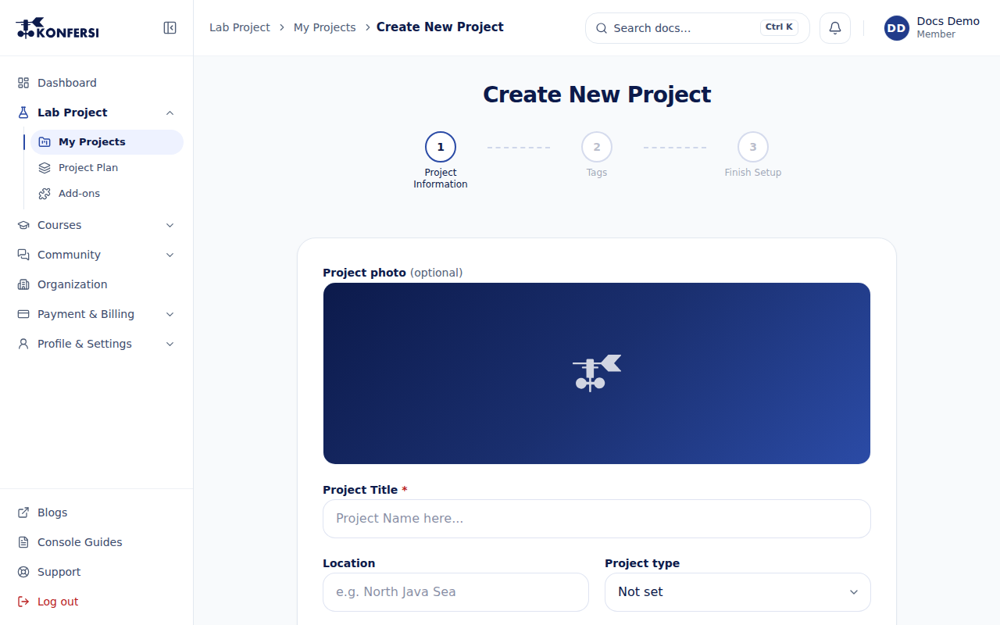
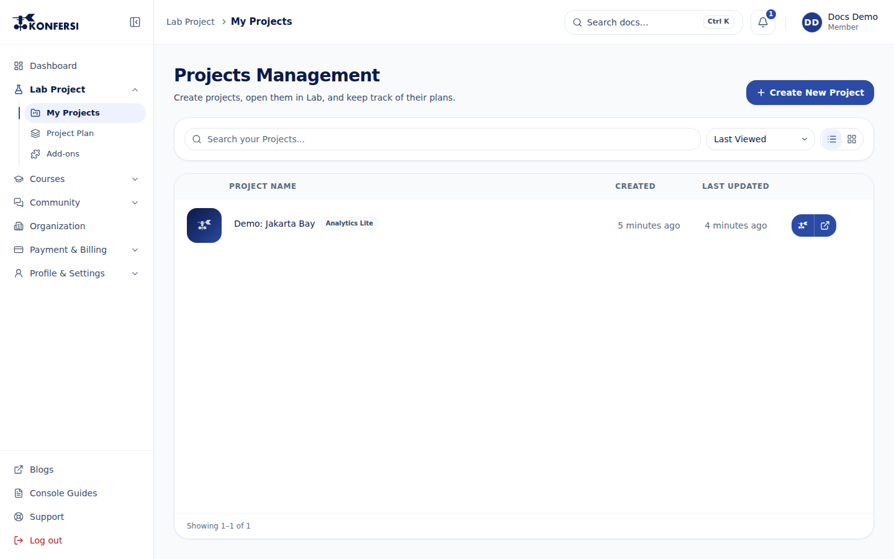

Console di [app.konfersi.com](https://app.konfersi.com) adalah tempat Anda mengatur pekerjaan. Semua aktivitas di Konfersi berlangsung di dalam sebuah **proyek**. Setiap proyek memiliki paket, kuota, dan anggotanya sendiri. Halaman ini menjelaskan cara membuat proyek, mengenali isinya, dan membagikannya.

## Mengenal Console

Menu samping memiliki bagian berikut:

- **Dasbor**: proyek terkini, aktivitas terbaru, ringkasan pemakaian, hal yang **Perlu perhatian Anda**, dan artikel terbaru kami.
- **Proyek Lab**: **Proyek Saya** (semua proyek milik Anda atau proyek tempat Anda diundang) dan **Paket Proyek & Add-on**.
- **Kursus**: **Marketplace** kursus dan **Kursus Saya**. Lihat [Kursus](courses.md).
- **Komunitas**: **Diskusi Artikel** dan **Tanya jawab member**. Lihat [Komunitas](community.md).
- **Organisasi**: anggota, proyek bersama, dan pengaturan tim Anda, jika Anda tergabung di organisasi. Lihat [Organisasi](organizations/index.md).
- **Pembayaran & Tagihan**: **Keranjang Pesanan** dan **Transaksi**. Lihat [Keranjang pesanan & transaksi](../billing/order-cart-and-transactions.md).
- **Profil & Pengaturan**: **Profil Saya** dan **Keamanan**. Lihat [Profil Anda](../account/profile.md) dan [Keamanan](../account/security/index.md).
- **Panduan Konsol** dan **Dukungan**. Lihat [Tiket dukungan](../support/support-tickets.md).

Saat pertama kali membuka Console, [panduan sambutan](console-guides.md) menawarkan tur (**Ikuti Tour**), pengaturan profil (**Pengaturan**), dan pintasan untuk membuat proyek pertama (**Buat**).

## Membuat proyek

1. Buka **Proyek Lab → Proyek Saya**, lalu pilih **Buat Proyek Baru**.
2. **Informasi Proyek**: isi **Judul Proyek** (wajib). **Deskripsi** boleh diisi atau dikosongkan. Pilih **Lanjutkan**.
3. **Tag**: cari tag yang sudah ada, atau ketik tag baru lalu pilih **Buat Baru**. Anda dapat menambahkan hingga 5 tag baru. Pilih **Lanjutkan**, atau **Lewati untuk Sekarang** jika ingin menambahkan tag nanti.
4. **Selesaikan Setup**: pilih salah satu kartu paket. Pilih **Lihat Detail Manfaat** untuk melihat isi tiap paket. Harga ditampilkan belum termasuk PPN.
5. Pilih **Pratinjau Setup**, lalu periksa ringkasan **Pratinjau Setup Proyek**.
6. Selesaikan:
   - Untuk paket uji coba gratis, pilih **Selesaikan Setup**. Proyek langsung dibuat.
   - Untuk paket berbayar, pilih **Lanjutkan Pembayaran** untuk mengatur dan membayar sekarang, atau **Masukkan ke Keranjang** untuk membayar nanti dari **Keranjang Pesanan**.

<scalar-callout type="info">Setiap akun hanya dapat membuat satu proyek uji coba gratis. Setelah digunakan, termasuk jika proyek tersebut kemudian di-upgrade, kartu uji coba gratis akan bertanda **Sudah Digunakan**. Silakan pilih paket lain.</scalar-callout>

Nama paket, isi paket, dan harga terkini diambil dari katalog yang berlaku dan ditampilkan di Console saat checkout. Untuk gambaran umum, lihat [Paket & harga](../billing/plans-and-pricing.md). Untuk proses pembayaran, lihat [Pembayaran](../billing/payments.md).

## Mencari dan membuka proyek

Di **Proyek Saya**, Anda dapat:

- Mencari lewat kolom **Cari Proyek Anda...**.
- Mengurutkan berdasarkan **Terakhir Dilihat**, **Terakhir Diperbarui**, **Dibuat**, atau **Nama A-Z**.
- Beralih antara tampilan kisi dan tampilan daftar.

Untuk membuka detail proyek, buka menu proyek lalu pilih **Detail**. Untuk langsung ke Lab, pilih **Lab Platform** atau klik ganda proyek tersebut.

## Isi halaman proyek

Halaman detail proyek menampilkan:

- **Ikhtisar Proyek**: **Slug Proyek**, tanggal dibuat, **Paket Saat Ini**, deskripsi, dan tag.
- **Akses Cepat Lab Platform**: tombol untuk membuka proyek ini di Lab.
- **Dokumen** dan **Aktivitas Proyek**: berkas di dalam proyek dan catatan aktivitas terbaru.
- **Pemantauan Kuota**: seberapa banyak jatah paket yang sudah terpakai, misalnya penyimpanan, jam komputasi, dan permintaan AI.
- **Tingkatkan Paket** dan **Beli Add-On**: cara menambah kapasitas untuk proyek ini.

### Peringatan kuota

Jika sebuah proyek sudah memakai **80%** dari suatu kuota, peringatan muncul di bagian atas **Pemantauan Kuota**, misalnya *Penyimpanan sudah terpakai 85% dari batasnya.* Jika kuota habis, tertulis *… sudah habis. Tambahkan kuota atau upgrade paket untuk terus bekerja.* Gunakan **Tingkatkan Paket** atau **Beli Add-On** untuk menambah kapasitas sebelum pekerjaan terhenti. Masa akses Lab, kursi pemilik, kursi asisten, dan slot pembuatan proyek tidak diberi peringatan: tanggal berakhirnya paket dan **Kelola Akses Proyek** sudah mencakupnya.

**Dasbor** juga menampilkan kuota yang paling mendekati batas di semua proyek Anda di bagian **Perlu perhatian Anda**, misalnya *Demo: Jakarta Bay: Penyimpanan terpakai 85%* dengan **Tambahkan add-on atau upgrade paket sebelum pekerjaan terhenti.** Pilih untuk membuka proyeknya. Jika tidak ada yang perlu ditangani, tampil **Semua sudah beres**.

<scalar-callout type="neutral">Lab memerlukan paket berbayar. Pada paket uji coba gratis, tombol Lab bertuliskan **Tingkatkan paket untuk akses Lab**. Jika paket proyek sudah berakhir, tombol dinonaktifkan dan menandakan bahwa paket telah kedaluwarsa.</scalar-callout>

### Mengubah proyek

Jika Anda pemilik proyek, buka menu **⋯** di halaman detail, lalu pilih **Edit Proyek**. Anda dapat mengubah judul dan deskripsi, serta menambah atau menghapus tag lewat **+ Tambah Tag**. Pilih **Simpan** untuk menyimpan perubahan, atau **Batalkan** untuk membatalkannya.

## Membagikan proyek

Proyek bersifat privat. Hanya pemilik dan orang yang diundang yang dapat membukanya. Jika paket atau add-on proyek menyertakan kursi asisten, pemilik dapat mengundang asisten dari menu **⋯** lewat **Kelola Akses Proyek**, membatalkan undangan yang tertunda, dan menghapus asisten. Asisten dapat keluar dari proyek lewat **Keluar dari proyek**.

Lihat [Membagikan proyek](project-sharing.md) untuk kursi, undangan, cara menerima undangan (juga saat Anda masuk dengan email lain), dan keluar dari proyek.

## Menghapus proyek

1. Di **Proyek Saya**, buka menu proyek lalu pilih **Hapus**.
2. Ketik `HAPUS PROYEK INI` untuk konfirmasi, lalu pilih **Hapus**.

<scalar-callout type="danger">Tindakan ini tidak dapat dibatalkan. Semua berkas, commit, dan data di dalam proyek akan dihapus secara permanen.</scalar-callout>

## Pemecahan masalah

**"Anda sudah memiliki proyek Free Trial. Silakan pilih paket lain."**
Akun Anda sudah memakai jatah uji coba gratis. Pilih paket berbayar.

**"Gagal memuat proyek"**
Pilih **Coba Lagi**. Jika proyek sudah dihapus atau akses Anda dicabut, proyek tidak dapat dibuka.

**Tombol Lab di Console tidak aktif.**
Proyek masih menggunakan paket uji coba gratis, atau paketnya sudah berakhir. Gunakan **Tingkatkan Paket**.

## Langkah berikutnya

- [Bekerja di Lab](lab-workspace.md)
- [Merencanakan operasi lepas pantai dengan Mission Planning](mission-planning.md)
- [Memahami data di balik analisis](metocean-data-sources.md)
